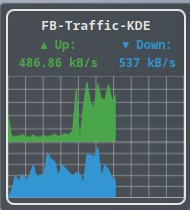

## FB-Traffic-KDE
 #The FB-Traffic-KDE widget is inspired by the Windows tool Fritz!Box Traffic and provides a similar function for KDE (Linux). The current version has been tested under Plasma5.

 # FB-Meter: Fritz!Box Traffic Monitor Plasmoid

FB-Meter is a KDE Plasma Plasmoid that displays the current upload and download speed of your AVM Fritz!Box. It provides a graphical representation of traffic history and numerical values in kB/s.<br>



## Features

*   Displays current upload and download rates in kB/s.
*   Graphical history of upload and download traffic.
*   Automatic scaling of graphs.
*   Configurable update interval (via `main.qml` -> `trafficSource.interval`).
*   Error handling for configuration, connection, and API issues with corresponding displays in the Plasmoid.
*   Data retrieval via a Python script using the `fritzconnection` library.
*   Configuration of Fritz!Box credentials via a separate INI file.

## How it Works

The Plasmoid consists of two main components:

1.  `main.qml`: Defines the user interface and the logic for displaying data. It periodically calls the Python script.
2.  `Traffic.py`: A Python script that connects to the Fritz!Box, retrieves traffic data, calculates the rates, and returns them to `main.qml` in JSON format.

The Python script stores the previous state of the byte counters and the timestamp of the last fetch to calculate the difference and thus the rate per second. Negative rates (e.g., after a Fritz!Box reboot) are interpreted as 0.00 kB/s.

## Installation and Configuration

### 1. Prerequisites

*   A working KDE Plasma Desktop environment.
*   Python 3.x.
*   The Python library `pip` (usually installed with Python).
*   The Python library `fritzconnection`. Install it with:
    ```bash
    pip install fritzconnection
    ```

### 2. Create Configuration File

Create a configuration file for the Python script at `~/.config/fritzplasmoid.ini` with the following content:

```ini
[credentials]
password = YOUR_FRITZBOX_PASSWORD
# host = fritz.box (optional, if different)
```

Replace `YOUR_FRITZBOX_PASSWORD` with your Fritz!Box password. The Fritz!Box user must have permission to retrieve information via the TR-064 interface (usually any user with access to the Fritz!Box interface).

**Important:** Ensure that "Access for applications" (TR-064) is enabled in your Fritz!Box. You can usually find this under `Home Network -> Network -> Network Settings -> Access for Applications`.

### 3. Place Plasmoid Files

1.  Create a folder for your Plasmoid, e.g., `~/.local/share/plasma/plasmoids/com.github.dezihh.fbtraffickde/`
2.  Inside this folder, create a subfolder named `contents`.
3.  Inside the `contents` folder, create another subfolder named `ui`.
4.  Place the `main.qml` file into the `contents/ui/` folder.
5.  Inside the `contents` folder, create another subfolder named `code`.
6.  Place the `Traffic.py` file into the `contents/code/` folder. Ensure `Traffic.py` is executable:
    ```bash
    chmod +x ~/.local/share/plasma/plasmoids/com.github.dezihh.fbtraffickde/contents/code/Traffic.py
    ```

The directory structure should look like this:

```
~/.local/share/plasma/plasmoids/com.github.dezihh.fbtraffickde/
├── contents/
│   ├── code/
│   │   └── Traffic.py
│   └── ui/
│       └── main.qml
│       └── qmldir
└── metadata.json
```

### 4. Register

<li>Go to directory ~/.local/share/plasma/plasmoids/ </li> 
<li>exectue ```kpackagetool5 --install ~/.local/share/plasma/plasmoids/com.github.dezihh.fbtraffickde``` </li> 
<li>execute ```kquitapp5 plasmashell && plasmashell &```</li> 
<li>Right click on the surface and choose "Add miniprogram" </li>
<li>Search and add "FB-Traffic-KDE</li>
Optional: Right Click again and add "Editting Mode". Than you can move an resitze the widget

## Troubleshooting

*   **"NoCfg", "CfgKeyErr", "CfgReadErr"**: Check the configuration file `~/.config/fritzplasmoid.ini` for existence, correct paths, and content.
*   **"ConErr"**: Check the network connection to the Fritz!Box, the hostname in the configuration file, and whether "Access for applications" (TR-064) is enabled in the Fritz!Box. Also, ensure the password is correct.
*   **"APIErr"**: This indicates a problem retrieving data from the Fritz!Box after the connection was established. This might be due to an incompatible Fritz!OS version or changed API endpoints. The script already tries to use common variants.
*   **"Error", "ParseErr" in Plasmoid**: This usually points to an issue with the output of the `Traffic.py` script (e.g., not valid JSON or one of the error codes mentioned above). Check the script's output by running it manually in a terminal:
    ```bash
    python ~/.local/share/plasma/plasmoids/com.github.dezihh.fbtraffickde/contents/code/Traffic.py
    ```
*   **Plasmoid permanently shows "Loading..."**: The Python script is not being executed correctly or is not returning data. Check the paths in `main.qml` to the `Traffic.py` file (`plasmoid.file("code") + "Traffic.py"`) and the script's execution permissions.

```

** Debugging help: **
- Restart Plasma interface: kquitapp5 plasmashell && plasmashell &
- Restart: plasmoidviewer --applet com.github.dezihh.fbtraffickde
- Re-register service: kpackagetool5 --install ~/.local/share/plasma/plasmoids/com.github.dezihh.fbtraffickde
- Update service: kpackagetool5 --upgrade ~/.local/share/plasma/plasmoids/com.github.dezihh.fbtraffickde
- Debugging: plasmoidviewer -a com.github.dezihh.fbtraffickde

