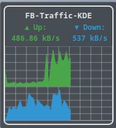

## FB-Traffic-KDE
# Fritz!Box Traffic Monitor Plasmoid for KDE Plasma 6

The FB-Traffic-KDE widget is inspired by the Windows tool Fritz!Box Traffic and provides a similar function for KDE (Linux). **This version is designed for KDE Plasma 6.**

FB-Traffic-KDE is a KDE Plasma Plasmoid that displays the current upload and download speed of your AVM Fritz!Box. It provides a graphical representation of traffic history and numerical values in kB/s.



## Features

*   Displays current upload and download rates in kB/s.
*   Graphical history of upload and download traffic.
*   Automatic scaling of graphs.
*   Configurable update interval via plasmoid settings.
*   Error handling for configuration, connection, and API issues with corresponding displays in the Plasmoid.
*   Data retrieval via a Python script using the `fritzconnection` library.
*   Configuration of Fritz!Box credentials via a separate INI file.

## How it Works

The Plasmoid consists of two main components:

1.  `main.qml`: Defines the user interface and the logic for displaying data. It periodically calls the Python script using the Plasma5Support DataSource compatibility layer.
2.  `Traffic.py`: A Python script that connects to the Fritz!Box, retrieves traffic data, calculates the rates, and returns them to `main.qml` in JSON format.

The Python script stores the previous state of the byte counters and the timestamp of the last fetch to calculate the difference and thus the rate per second. Negative rates (e.g., after a Fritz!Box reboot) are interpreted as 0.00 kB/s.

## Installation and Configuration

### 1. Prerequisites

*   **KDE Plasma 6.x** Desktop environment
*   Python 3.x
*   The Python library `fritzconnection`. Install it with:
    ```bash
    pip install fritzconnection
    ```

### 2. Create Configuration File

Create a configuration file for the Python script at `~/.config/fritzplasmoid.ini` with the following content:

```ini
[credentials]
password = YOUR_FRITZBOX_PASSWORD
# host = fritz.box (optional, if different)
```

Replace `YOUR_FRITZBOX_PASSWORD` with your Fritz!Box password. The Fritz!Box user must have permission to retrieve information via the TR-064 interface (usually any user with access to the Fritz!Box interface).

**Important:** Ensure that "Access for applications" (TR-064) is enabled in your Fritz!Box. You can usually find this under `Home Network -> Network -> Network Settings -> Access for Applications`.

### 3. Install the Plasmoid

**Option A: Manual Installation**

1.  Clone or download this repository
2.  Copy the `com.github.dezihh.fbtraffickde` folder to `~/.local/share/plasma/plasmoids/`
3.  Make the Python script executable:
    ```bash
    chmod +x ~/.local/share/plasma/plasmoids/com.github.dezihh.fbtraffickde/contents/code/Traffic.py
    ```

**Option B: Using kpackagetool6**

```bash
kpackagetool6 -t Plasma/Applet --install com.github.dezihh.fbtraffickde
```

The directory structure should look like this:

```
~/.local/share/plasma/plasmoids/com.github.dezihh.fbtraffickde/
├── contents/
│   ├── code/
│   │   └── Traffic.py
│   ├── config/
│   │   └── config.qml
│   └── ui/
│       ├── main.qml
│       └── configGeneral.qml
└── metadata.json
```

### 4. Add the Widget

1.  Right-click on your desktop or panel
2.  Choose "Add Widgets" or "Add Widget..."
3.  Search for "FB-Traffic-KDE"
4.  Click to add it to your desktop/panel

Optional: Right-click again and choose "Enter Edit Mode" to move and resize the widget.

## Troubleshooting

*   **"NoCfg", "CfgKeyErr", "CfgReadErr"**: Check the configuration file `~/.config/fritzplasmoid.ini` for existence, correct paths, and content.
*   **"ConErr"**: Check the network connection to the Fritz!Box, the hostname in the configuration file, and whether "Access for applications" (TR-064) is enabled in the Fritz!Box. Also, ensure the password is correct.
*   **"APIErr"**: This indicates a problem retrieving data from the Fritz!Box after the connection was established. This might be due to an incompatible Fritz!OS version or changed API endpoints. The script already tries to use common variants.
*   **"Error", "ParseErr" in Plasmoid**: This usually points to an issue with the output of the `Traffic.py` script (e.g., not valid JSON or one of the error codes mentioned above). Check the script's output by running it manually in a terminal:
    ```bash
    python ~/.local/share/plasma/plasmoids/com.github.dezihh.fbtraffickde/contents/code/Traffic.py
    ```
*   **Plasmoid permanently shows "Loading..."**: The Python script is not being executed correctly or is not returning data. Check the script's execution permissions.

## Debugging Help

```bash
# Restart Plasma interface (KDE 6)
kquitapp6 plasmashell && plasmashell &

# Test the plasmoid in plasmoidviewer
plasmoidviewer -a com.github.dezihh.fbtraffickde

# Re-register the plasmoid
kpackagetool6 -t Plasma/Applet --install ~/.local/share/plasma/plasmoids/com.github.dezihh.fbtraffickde

# Update an existing installation
kpackagetool6 -t Plasma/Applet --upgrade ~/.local/share/plasma/plasmoids/com.github.dezihh.fbtraffickde

# View plasma logs for debugging
journalctl --user -u plasma-plasmashell -f
```

## Version History

*   **2.0**: Refactored for KDE Plasma 6 compatibility
    *   Updated metadata.json format for Plasma 6
    *   Migrated from deprecated PlasmaCore.DataSource to Plasma5Support.DataSource
    *   Added PlasmoidItem as root element
    *   Added configuration UI for refresh interval and graph settings
    *   Improved directory structure following KDE 6 conventions
*   **1.0**: Initial version for KDE Plasma 5

## License

MIT License

